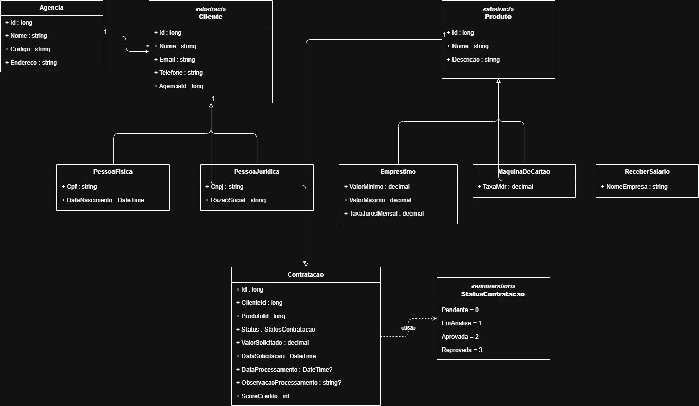

# Banco Digital — API

## 1. Identificação

| Nome | RM |
|------|----|
| Vinícius Monteiro Araújo | RM555088 |
| Rafael Gaspar | RM557228 |


## 2. Produto bancário escolhido

**Empréstimo Pessoal**

O produto Empréstimo foi escolhido por ser o que melhor demonstra análise de crédito — o ponto central da atividade. A contratação é registrada com status `Pendente` e pode ser consultada a qualquer momento pelo endpoint de status.

## 3. Diagrama de classes

Arquivo fonte: [docs/diagrama-classes.drawio](docs/diagrama-classes.drawio)



## 4. Como rodar localmente

### Pré-requisitos
- .NET 8.0 SDK
- Acesso à rede da FIAP (VPN ou presença física) para Oracle

### Banco de dados
```bash
cd BancoDigital.Api
dotnet ef database update
```

### Executar a API

Na pasta raiz do projeto:
```bash
dotnet run --project BancoDigital.Api
```

Ou entrando na pasta do projeto:
```bash
cd BancoDigital.Api
dotnet run
```

Swagger disponível em: http://localhost:5186/swagger

## 5. Endpoints disponíveis

### POST /api/agencias
```json
Request:
{
  "nome": "Agência Centro",
  "codigo": "0001",
  "endereco": "Av. Paulista, 1000 - São Paulo/SP"
}

Response 201:
{
  "id": 1,
  "nome": "Agência Centro",
  "codigo": "0001",
  "endereco": "Av. Paulista, 1000 - São Paulo/SP"
}
```

### GET /api/agencias/{id}
```json
Response 200:
{
  "id": 1,
  "nome": "Agência Centro",
  "codigo": "0001",
  "endereco": "Av. Paulista, 1000 - São Paulo/SP"
}
```

### POST /api/clientes/pf
```json
Request:
{
  "nome": "João da Silva",
  "email": "joao@email.com",
  "telefone": "11999999999",
  "agenciaId": 1,
  "cpf": "12345678901",
  "dataNascimento": "1990-05-15"
}

Response 201:
{
  "id": 1,
  "nome": "João da Silva",
  "email": "joao@email.com",
  "telefone": "11999999999",
  "agenciaId": 1,
  "tipoCliente": "PF",
  "cpf": "12345678901",
  "dataNascimento": "1990-05-15T00:00:00",
  "cnpj": null,
  "razaoSocial": null
}
```

### POST /api/clientes/pj
```json
Request:
{
  "nome": "Empresa LTDA",
  "email": "contato@empresa.com",
  "telefone": "1133334444",
  "agenciaId": 1,
  "cnpj": "12345678000195",
  "razaoSocial": "Empresa Teste LTDA"
}

Response 201:
{
  "id": 2,
  "nome": "Empresa LTDA",
  "email": "contato@empresa.com",
  "telefone": "1133334444",
  "agenciaId": 1,
  "tipoCliente": "PJ",
  "cpf": null,
  "dataNascimento": null,
  "cnpj": "12345678000195",
  "razaoSocial": "Empresa Teste LTDA"
}
```

### GET /api/clientes/{id}
```json
Response 200:
{
  "id": 1,
  "nome": "João da Silva",
  "email": "joao@email.com",
  "telefone": "11999999999",
  "agenciaId": 1,
  "tipoCliente": "PF",
  "cpf": "12345678901",
  "dataNascimento": "1990-05-15T00:00:00",
  "cnpj": null,
  "razaoSocial": null
}
```

### POST /api/contratacoes
```json
Request:
{
  "clienteId": 1,
  "produtoId": 1,
  "valorSolicitado": 15000.00
}

Response 202:
{
  "id": 1,
  "status": "Pendente",
  "mensagem": "Contratação recebida."
}
```

### GET /api/contratacoes/{id}
```json
Response 200:
{
  "id": 1,
  "clienteId": 1,
  "nomeCliente": "João da Silva",
  "produtoId": 1,
  "nomeProduto": "Empréstimo Pessoal",
  "status": "Pendente",
  "valorSolicitado": 15000.00,
  "dataSolicitacao": "2026-05-05T10:00:00Z",
  "dataProcessamento": null,
  "observacaoProcessamento": null,
  "scoreCredito": null
}
```

## 6. Como executar os testes

```bash
dotnet test --logger "console;verbosity=normal"
```


## 7. Evidências da API no Swagger

### POST /api/agencias → 201


### GET /api/agencias/{id} → 200


### POST /api/clientes/pf → 201


### GET /api/clientes/{id} → 200


### POST /api/clientes/pj → 201


### POST /api/contratacoes → 202


### GET /api/contratacoes/{id} → 200

